<a href="https://github.com/Sourav341/Sourav341">
  <picture>
    <source media="(prefers-color-scheme: dark)" srcset="./dark.svg">
    
  </picture>
  

    
  

</a>

<h2 align="center">Software Developer • Backend • Full Stack • Automation</h2>

  
  
  

---

## `$ whoami`

Software Developer based in Bangalore, India, focused on backend systems, full-stack
applications, REST APIs, automation, databases, and practical production-oriented software.

## `$ tech --stack`

| Area | Technologies |
|---|---|
| Languages | Java · C# · Python · JavaScript |
| Frontend | HTML · CSS · React |
| Backend | ASP.NET Core · Node.js · REST APIs |
| Databases | SQL Server · MySQL · PostgreSQL |
| DevOps / Cloud | Docker · Linux · Azure |
| Testing / Automation | Selenium · Test Automation |
| Tools | Git · Postman · REST API tooling |

## `$ current.status`

- Building and maintaining backend and full-stack applications
- Working with APIs, relational databases, automation, and deployment workflows
- Improving architecture, developer tooling, testing, and production engineering practices

## `$ connect`

- **GitHub:** [Sourav341](https://github.com/Sourav341)
- **LinkedIn:** [Sourav Singh](https://www.linkedin.com/in/sourav-singh-immediate-joiner-61aa16100/)
- **Email:** [rajosurav.singh58@gmail.com](mailto:rajosurav.singh58@gmail.com)

## `$ github --activity`

The animated contribution jet above is generated from the real GitHub contribution calendar
and refreshed automatically by GitHub Actions.
